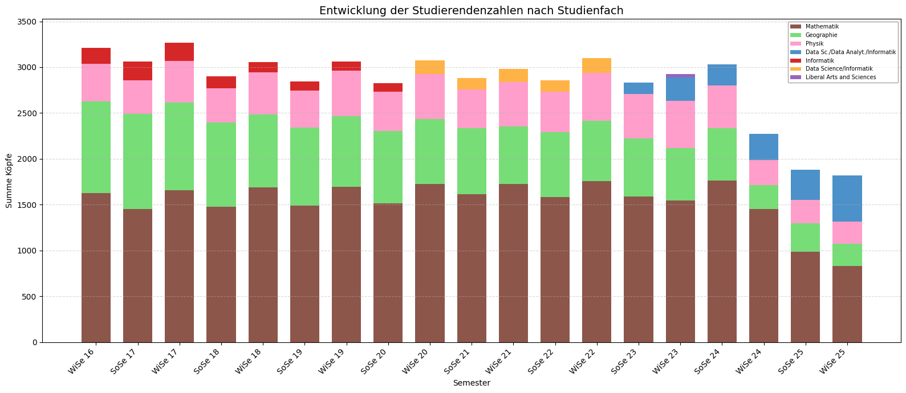
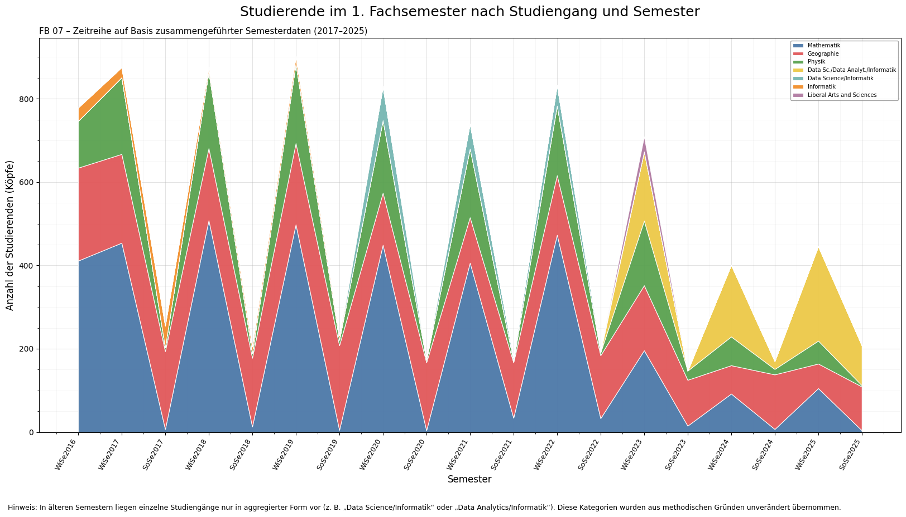
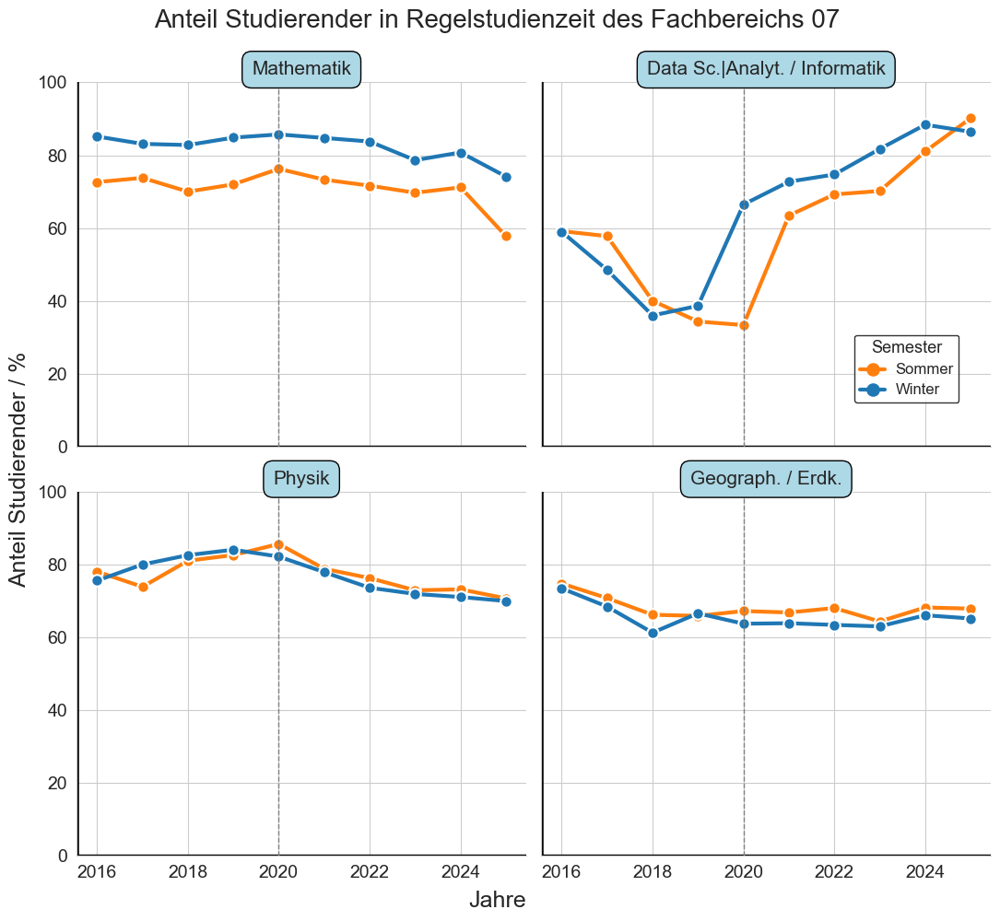
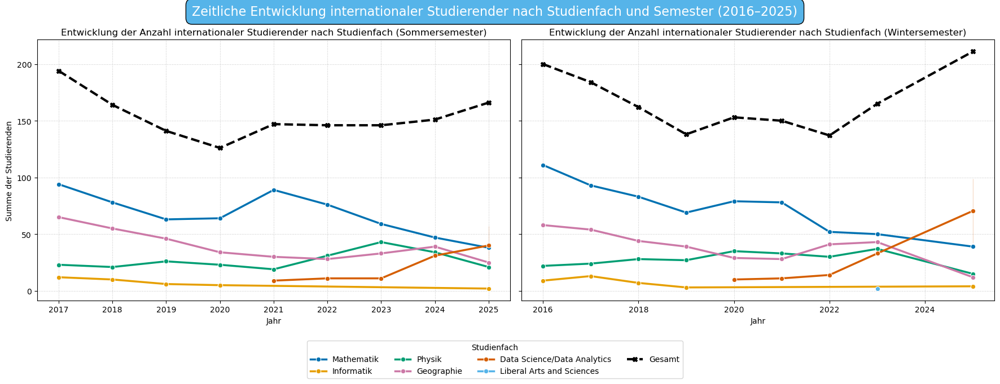
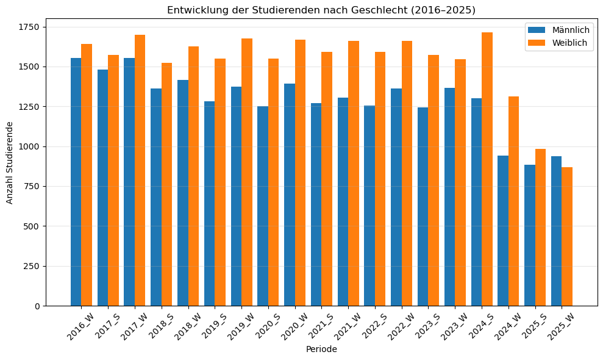

## Jlu-student-data-visualization
Data analysis and visualization of student statistics from Justus Liebig University Giessen (JLU), focusing on Faculty 07 (Mathematics, Computer Science, Physics, Geography) from 2016 to 2025. The project explores trends in student enrollment using available university data and presents the results through statistical analysis/visualizations.

#
This project was developed as part of the university course "Informationsvisualisierung" (Information Visualization).

## Project Objectives

- Extract and preprocess historical university data
- Harmonize datasets from multiple semesters
- Create meaningful visualizations
- Analyze long-term academic trends
- Study the evolution of student populations
- Present insights using data storytelling

## Dataset

The datasets originate from official student statistics of Justus Liebig University Giessen (JLU).
Time period:
- Winter semester 2016
- to Winter semester 2025
Data sources:
- PDF university reports
- Excel files
- Internal statistical tables

## My Contributions

My main contributions in this team project included:
- Data extraction and preprocessing
- Harmonization of semester datasets
- Python data cleaning pipelines using pandas
- Development of visualizations
- Interpretation of analytical results
- Contribution to presentation structure

## Technologies

- Python
- Power BI
- Power Query
- pandas
- matplotlib
- LaTeX
- Jupyter Notebook

## Methodology

### Data Extraction
- Historical PDF reports were extracted using Power BI
- Recent Excel datasets were processed directly with Python

### Data Cleaning
- Harmonization of semester categories
- Replacement of missing values
- Removal of duplicates
- Standardization of study program names

### Visualization
Several visualization techniques were used:
- Stacked bar charts
- Stacked area charts
- Line charts
- Comparative visual analysis

## Student Data Visualization – JLU FB07

### Study Programs

Description: Visualization of the evolution of study programs between 2016 and 2025.
Key Finding: Mathematics remained the largest study field throughout the observation period. While Geography and Physics stayed relatively stable, Data Science and Informatics experienced noticeable growth in recent years, reflecting the increasing demand for data-oriented academic programs.
   

### First-Semester Students

Description : Development of first-semester student numbers over time.
Key Finding: A strong seasonal pattern can be observed, with Winter Semesters consistently attracting significantly more new students than Summer Semesters. Data-related programs showed the strongest growth, indicating increasing interest in digital and analytical skills.
  

### Standard Study Period

Description: Comparison of the proportion of students within the standard study period.
 
Key Finding: Most programs maintained a standard-study-period rate between 60% and 85%. Information technology-related programs displayed higher variability, partly due to newly introduced degree programs and the impact of the COVID-19 pandemic.
  

### International Students

Description: Evolution of international student populations.
Key Finding: After a temporary decline around 2020, the number of international students increased steadily and reached its highest level by 2025. Data Science showed the strongest growth among international students, highlighting its increasing international attractiveness.
  

### Gender Distribution

Description: Comparison of male and female student populations.
Key Finding: Female students slightly outnumbered male students during most semesters. Student numbers remained relatively stable until 2023, after which both groups experienced a noticeable decline that may be related to changes in data availability or enrollment patterns.
  

  

### Overall Insights

- Mathematics remained the dominant study field throughout the observation period.
- Data Science and Informatics experienced the strongest growth.
- Winter Semesters consistently attracted more students than Summer Semesters.
- International student numbers increased significantly after 2022.
- Several indicators suggest structural changes in student enrollment patterns after 2024.
## Team Project

This project was developed collaboratively
as part of a university group project.

Team members contributed to:
- data preparation,
- visualization,
- interpretation,
- and presentation development.

## Full Report

The complete academic report is available here:

[WiSe26_G13_EPortfolio.pdf](report/WiSe26_G13_EPortfolio.pdf)

## Presentation

## Future Improvements

Possible future extensions include:
- Interactive dashboards
- Advanced statistical analysis
- Predictive modeling
- Web-based visualization interfaces

06.03.2026

# Auseinandersetzung mit dem Datensatz aus dem Justus-Portal:
 -Analyse der allgemeinen Datenstruktur  
 -Klärung der verwendeten Begriffe und Abkürzungen( Spalten, Zeilen usw)

# Wahl der Variablen:
-Variable1: Geschlecht
-Variable2: Studiengang
-Variable3: Ausländische Studierende
-Variable4: StudienanfängerInnen
-Variable5: Abschlussquote???
-Variable6: Alter???
 
# Schwierigkeiten/Aufgaben bis zum nächsten Termin: 
-Daten von 24-25 und 2025-26?
-Daten zum Alter?
-Daten zur Abschlussquote?
-Weitere Variablen aussuchen
-Sich weiter mit der Anleitung zum E-Portfolio vertraut machen und sie gründlich durchgehen,
 
Nächstes Treffen:  in der Whatsappgruppe zu vereinbaren
